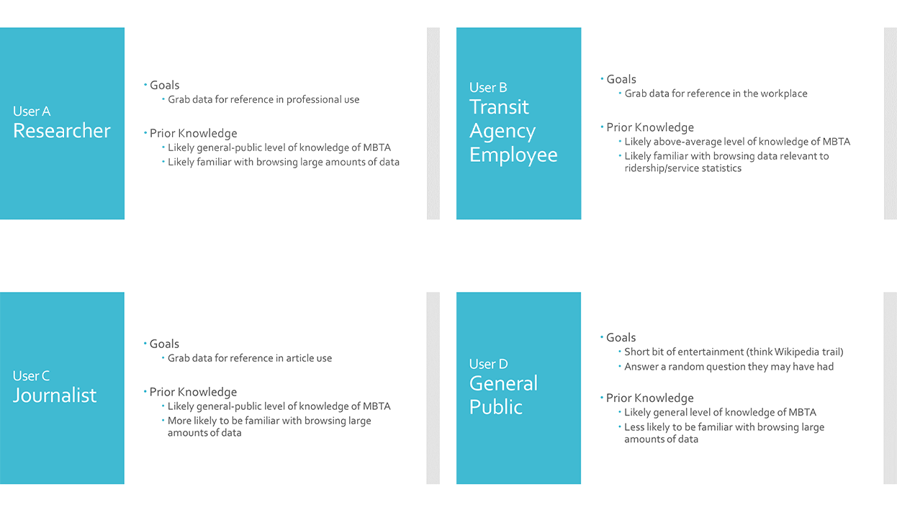
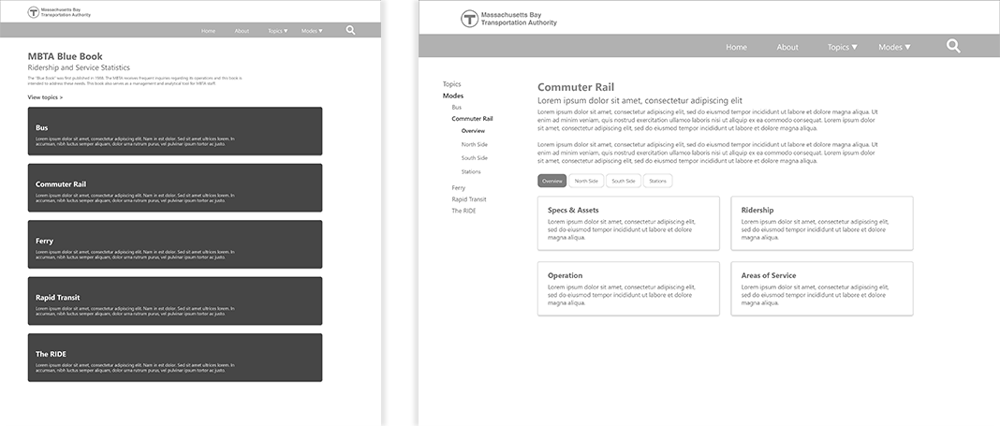
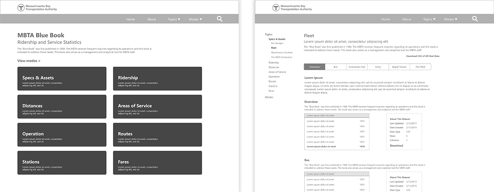
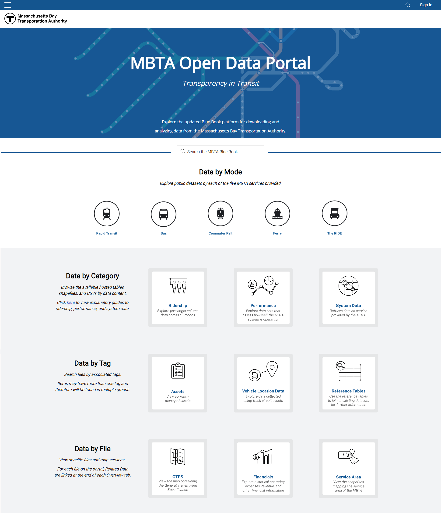

import Underlining from "../../../src/styles/underlining"

<Underlining highlight>Adobe XD</Underlining>
 
 

## Background

The MBTA has published several editions of the MBTA Ridership and Service Statistics, also known as the “Blue Book”, since 1988. The Blue Book contains a collection of MBTA data such as ridership, bus speeds, track distances, fleet rosters, and more, but its updates have been inconsistent and its lengthy PDF format was inconvenient to navigate.

During my seven-month co-op at MassDOT/MBTA’s <a href="https://www.mass.gov/transportation-performance" target="_blank">OPMI</a>, another co-op and I worked on converting the PDF into a website. While he worked on the data organization aspect of the project, **I led the redesign process of transforming the Blue Book PDF into an interactive website.**

## Process

I wanted to focus on creating a user-focused experience that was inviting, accessible, and organized, so I created user personas to narrow down exactly what experience I wanted these users to have.

Four different user personas for who would be using the Blue Book

The 2014 Blue Book just compiled every piece of data that was available into one long document, but I wanted to reduce the amount of time and thinking it took for a user to find what they were looking for and make the data actually useful. We combed through the data in the old Blue Book and organized everything that was available, documenting things like what categories data fell under, what level of specificity was available, or what types of files were there.

<a href="https://old.mbta.com/uploadedfiles/documents/2014%20BLUEBOOK%2014th%20Edition(1).pdf" target="_blank">View the full 2014 Blue Book &#8594;</a>

This led to my decision to have two main “branches” of categorization, mode and topic, because users may be interested in viewing the data for *all* topics related to *one* mode of transportation or the data for *all* modes of transportation related to *one* topic.

"Mode" flow of viewing data

"Topic" flow of viewing data

## Final Product

After reviewing the technology available to us, my team and I decided to change direction with the project—instead of building a brand-new website, it would be easier to create an open data portal to host all the data the Blue Book had printed. Though the functions of the website were different from the original designs, many of my ideas were incorporated into the now-functional Blue Book open data portal.

Blue Book open data portal homepage

 
 
<a href="https://mbta-massdot.opendata.arcgis.com/" target="_blank">View Blue Book open data portal &#8594;</a> 

