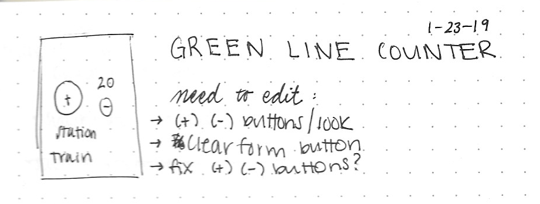
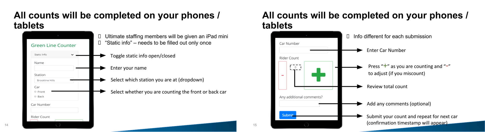
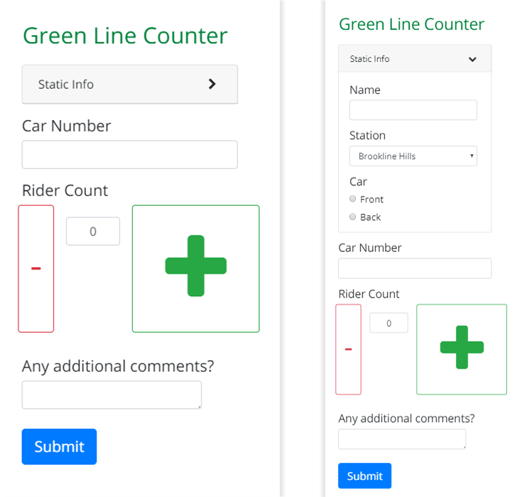

import Underlining from "../../../src/styles/underlining"

<Underlining highlight>HTML</Underlining> <Underlining highlight>CSS</Underlining> <Underlining highlight>Javascript</Underlining> <Underlining highlight>Angular</Underlining> <Underlining highlight>Bootstrap</Underlining> 

## Background

It’s challenging for MBTA employees to accurately count the number of people boarding Green Line cars. Counts were traditionally done by hand, in pairs standing outside with tally counters and clicking for everyone who got on the train followed by writing the results on paper. This method was a bit clumsy since a clipboard, pen, and clicker needed to be carried; it also drew a lot of passengers’ attention.

During my seven-month co-op at MassDOT/MBTA’s <a href="https://www.mass.gov/transportation-performance" target="_blank">OPMI</a>, my fellow co-op and I decided to **design, code, and implement a Green Line Counter web app** that would simplify the act of counting Green Line boardings.

## Process

After noting what details needed to be recorded, we created a simple web page that used a script to send all the information to a Google sheet. I took the unstyled form and optimized it for actual use by prioritizing two points:
- Counting is a quick process and you need to pay more attention to your surroundings than your phone
- Counters would be using their mobile phone or an iPad

Early sketch of the counter app

Along with a few coworkers, we tested the app on our own by doing a few counts on the commute to/from work, which consisted of standing on the T platform and pressing the plus button for each passenger that boarded a train car. Thanks to this field testing, I was able to identify and fix a few unexpected problems. These pain points included the plus button not being large enough, switching the order of plus and minus buttons, and adding the ability to manually type a number in.

## Final Product

The final web app design minimized user interaction, saving details like what station you were at or if you were counting for the front/back car; it was also responsive to different screen sizes. The app ended up being used by staff to carry out Green Line counts, and I was also able to help present the app at the staff orientation and carry out a few Green Line counts myself.

Tutorial slides used in a presentation during surveyor orientation and training

The counter in two stages: static info collapsed on the left and expanded on the right

