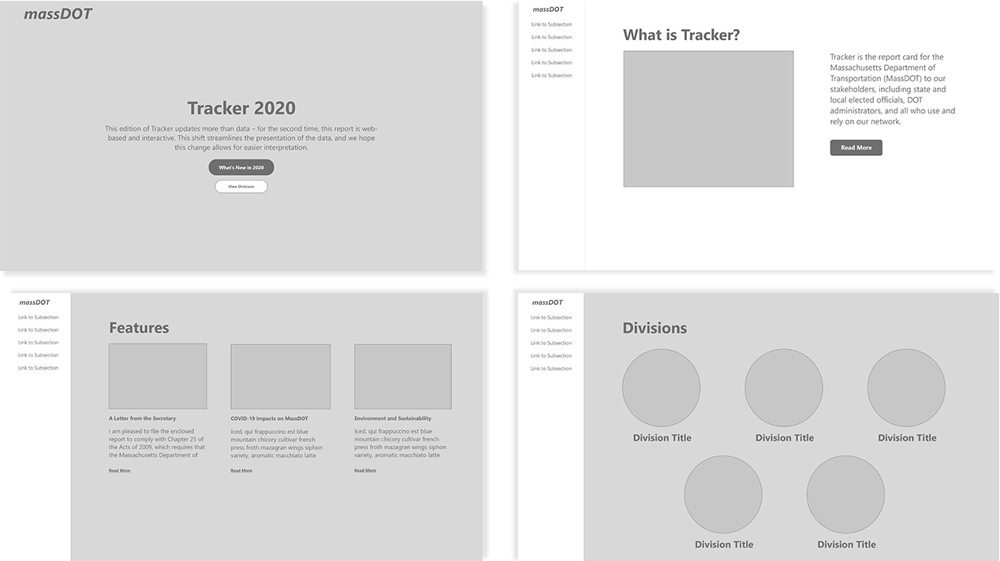

import Underlining from "../../../src/styles/underlining"

<Underlining highlight>Wordpress</Underlining> <Underlining highlight>PHP</Underlining> <Underlining highlight>HTML</Underlining> <Underlining highlight>CSS</Underlining> <Underlining highlight>Adobe XD</Underlining> 
 
 

 <a href="https://www.massdottracker.com/wp/" target="_blank">View live version &#8594;</a>

## Background

Tracker is the Massachusetts Department of Transportation (MassDOT)'s annual report card that reviews the progress MassDOT has made over the course of a year. In previous years, Tracker was a <a href="https://www.mass.gov/lists/tracker-annual-performance-management-reports" target="_blank">multi-page PDF</a> distributed virtually and in print; however, in 2018, Tracker was reworked into an additional interactive website.

During my seven-month co-op at MassDOT/MBTA’s <a href="https://www.mass.gov/transportation-performance" target="_blank">OPMI</a>, one of my projects was to **redesign the Tracker 2018 website for the updated 2019 version**.

## Process

Looking to Tracker 2018 for inspiration, I knew I wanted to encourage user interactivity, uphold accessibility, and make the site visually appealing to the reader. 
Some new additions were considered, like
- How to make graphs and charts more appealing and interactive
- Celebrating the tenth anniversary of MassDOT
- Choosing a new color scheme and redesigning icons

> *First web version of Tracker, hosted on Squarespace*

I collaborated with another intern on choosing a color scheme and icon design for the new version of Tracker. We were also switching from Squarespace to Wordpress for hosting, which gave me a world of options in terms of themes to use. I chose a theme that achieved my goals, customizing the options or small details in the code as I saw fit. I also documented every change and decision I made, since editing the site would continue after my co-op ended.

## Final Product

Tracker 2019 was published in December 2019. 

> *Published 2019 version of Tracker*

## Further Work

When I returned to work part-time at OPMI the folllowing year, I was again given the chance to redesign Tracker for the new year’s edition. My team and I talked about expanding the idea of Tracker being a narrative we’re trying to guide the user through, so I designed a few iterations centering around this idea.

I also worked on creating an updated color scheme and style guide for Tracker 2020. Because my internship ended before the site would go up, I documented the changes I made to the theme and the style guide I created for the next person to take up redesign efforts.

Tracker 2020 was published in December 2020. 

> *Published 2020 version of Tracker*